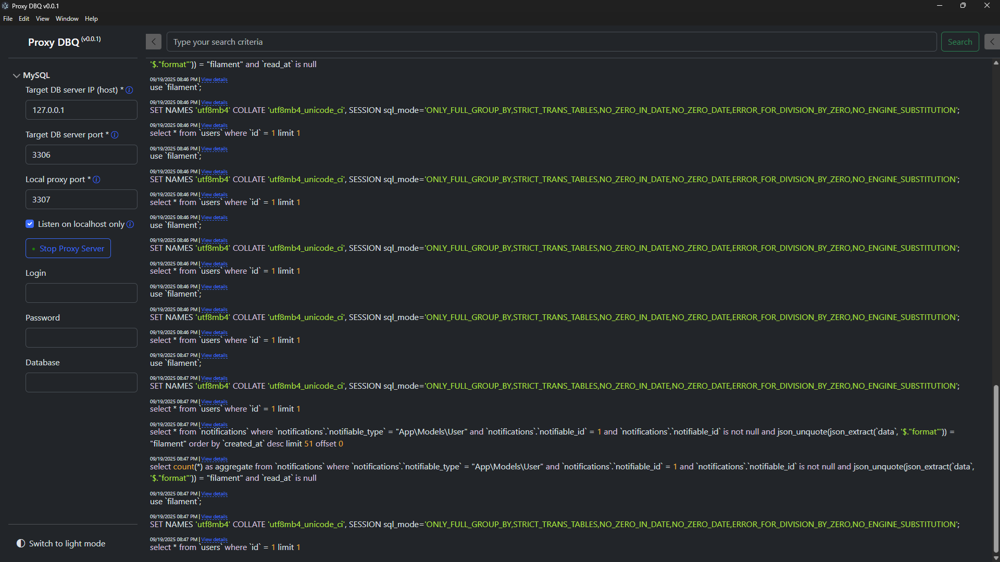
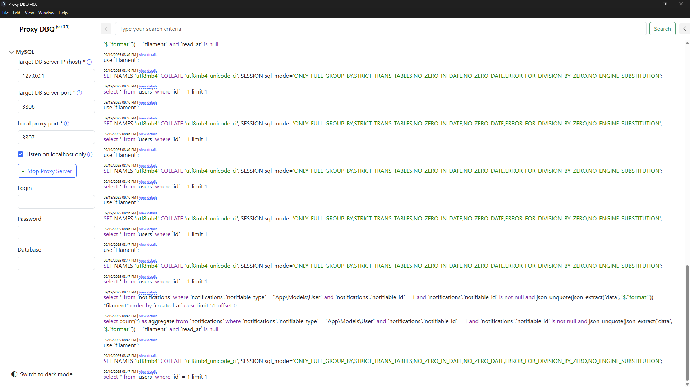
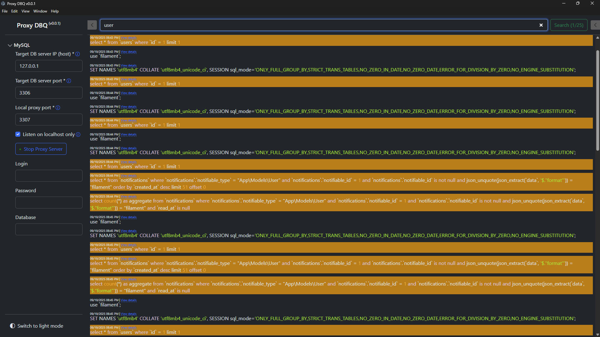
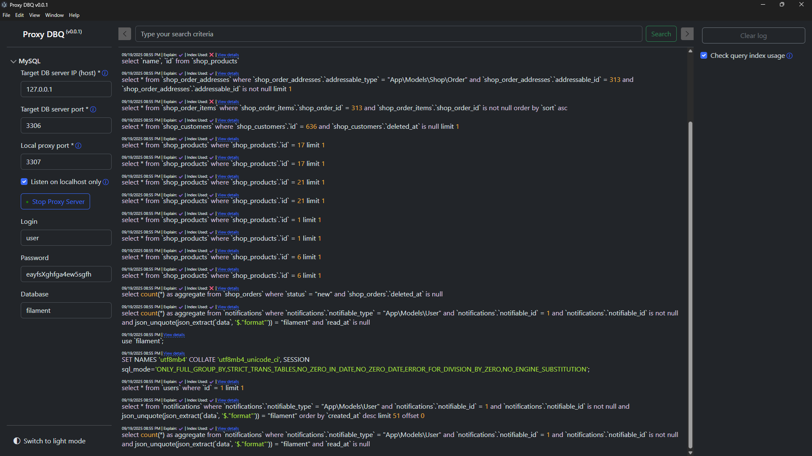
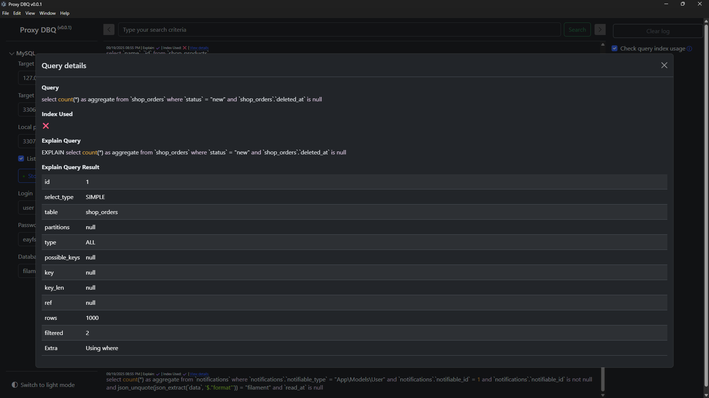

# Proxy DBQ

This developer's tool is a proxy between your website and database, giving you full visibility into all executed queries. It automatically identifies performance bottlenecks and highlights slow queries that need indexing. Currently, supports `MySQL`, with `PostgreSQL` and `MongoDB` support coming soon.

## Interface

<a href="images/proxy-dbq-screenshot-1-dark.png"></a>
<a href="images/proxy-dbq-screenshot-2-light.png"></a>
<a href="images/proxy-dbq-screenshot-3-dark-search.png"></a>
<a href="images/proxy-dbq-screenshot-4-dark-index-usage.png"></a>
<a href="images/proxy-dbq-screenshot-5-dark-query-details.png"></a>
<div style="clear: both;"></div>

## Usage

Assuming your MySQL database server is running locally. Otherwise, use your server IP address instead of `127.0.0.1`.

### Local host

1. Specify the port at which the Proxy DBQ runs (default 3307) in your application configuration file. For example, in Laravel PHP `.env` file add `DB_PORT=3307`.
2. Use `127.0.0.1` as `Target DB server IP`, `3306` as `Target DB server port` and `3307` as `Local proxy port` in Proxy DBQ interface.
3. Hit `Start Proxy Server` button in Proxy DBQ interface.

### Docker

1. Specify the port at which the Proxy DBQ runs (default 3307) in your application configuration file. For example, in Laravel PHP `.env` file add `DB_PORT=3307`.
2. Specify the database server host IP as `host.docker.internal` in your application configuration file. For example, in Laravel PHP `.env` file add `DB_HOST=host.docker.internal`.
3. Use `127.0.0.1` as `Target DB server IP`, `3306` as `Target DB server port` and `3307` as `Local proxy port` in Proxy DBQ interface.
4. Hit `Start Proxy Server` button in Proxy DBQ interface.

## Development

Built with Electron under the hood, Vue.js 3 and Bootstrap 5.

To set up the development environment:

1. Install dependencies:
    ```
    npm install
    ```

2. Start the development server:
    ```
    npm run dev
    ```

## Packaging for distribution

### Windows

`npm i`

`npm run package`

`npx electron-forge make`

`npm run publish`

The binary and the setup should appear in the `/dist/` folder.

## Known Problems

**`npm run package` gives the error - Cannot create symbolic link**

Run the command in the CLI with administrator permissions.

**`npm run package` errors: Cannot start service: Host version "0.21.5" does not match binary version "0.25.10"**

This is caused by a version mismatch in esbuild between the JavaScript host package and the native binary. Fix:

1) Remove install artifacts: delete `node_modules` and `package-lock.json`.
2) Ensure you are using Node 18+ and npm 9+.
3) Reinstall dependencies to pick up the pinned esbuild version: `npm install`.
4) Try packaging again: `npm run package`.

Note: The project pins esbuild to 0.21.5 to align with Vite. If you still see the error, run `npm cache verify` and repeat the steps above.

## TODO

* Test if Vitess, TiDB, MariaDB protocols are also supported. Update docs. Reflect supported protocols in UI.
* Remember query. A clickable star icon, that puts the query to the saved queries list. 
* View query. Click on a query to see the query details.
* Saved queries should not be removed.
* Access saved queries in query viewer.
* Debug mode. Make possible to see the internal operations and errors in the main log.
* Output time with seconds.
* Time format customizable.
* Add output styles: date on the left; date above the query;..
* Focus on search.
* Queries filter - time range; query type: SELECT, INSERT,..
* Window focus on search match. Highlight, expand and focus on app window when the search has a match.
* Show amount of search matches in search panel.
* Allow to navigate between search matches.
* "Scroll to bottom" button.
* Refactor code.
* Group requests by clientId/session - `[MySQL][127.0.0.1:61513]`?
* Beautify query button.
* Multiple connections.
* Request time taken.
* Slow logs. Configurable.
* Duplicates counter.
* Returned rows amount.
* Recommend SQL best practices - * -> list columns, index used columns, coverage indexes,..
* Recommend schema/query/index performance/normalization/denormalization improvements by analyzing query history.
* Notify about N+1 queries.
